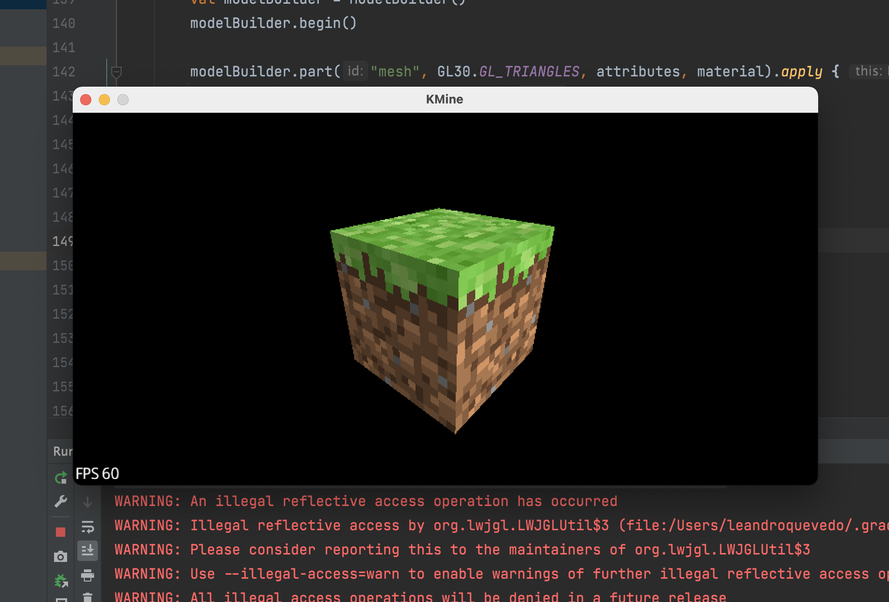
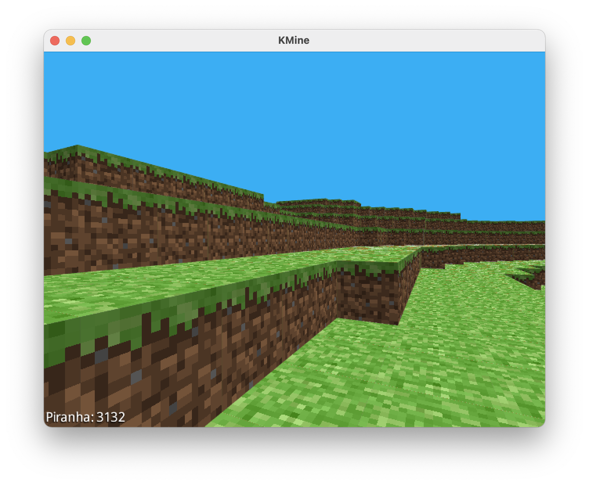

# KMine
A Minecraft clone made in Kotlin

## Development process
### Day 1
First contact with LibGDX and LWJGL ever, struggled to display a cube sharing the same texture and material but mapping a specific UV region on each Cube's face

### Day 2
Using the incredible [OpenSimplexNoise](https://gist.github.com/KdotJPG/b1270127455a94ac5d19) (The successor of Perlin noise) to generate a simple terrain
With an even simpler chunk system... The chunks doesn't know its surroundings, therefore adding unnecessary faces on the draw calls
