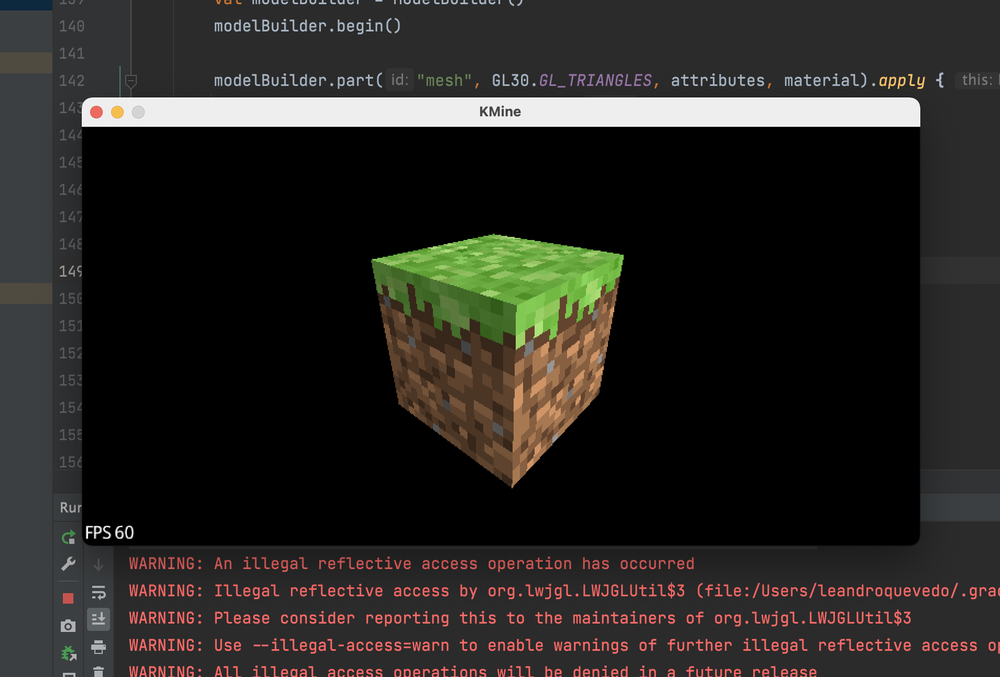
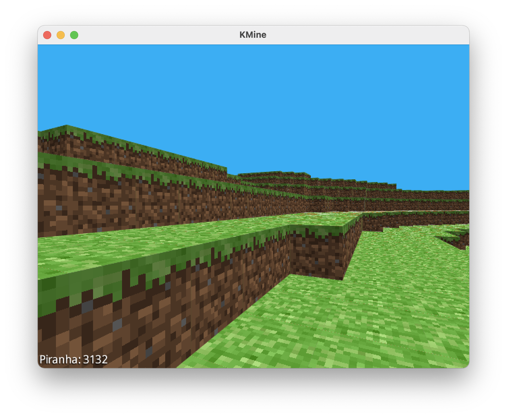
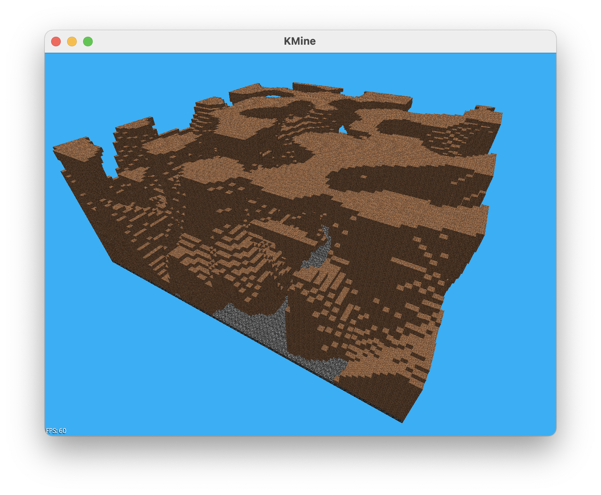
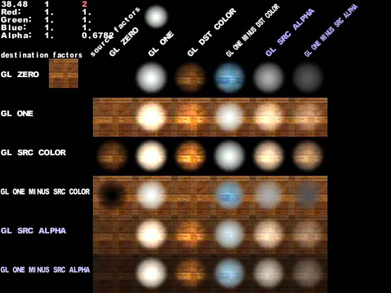
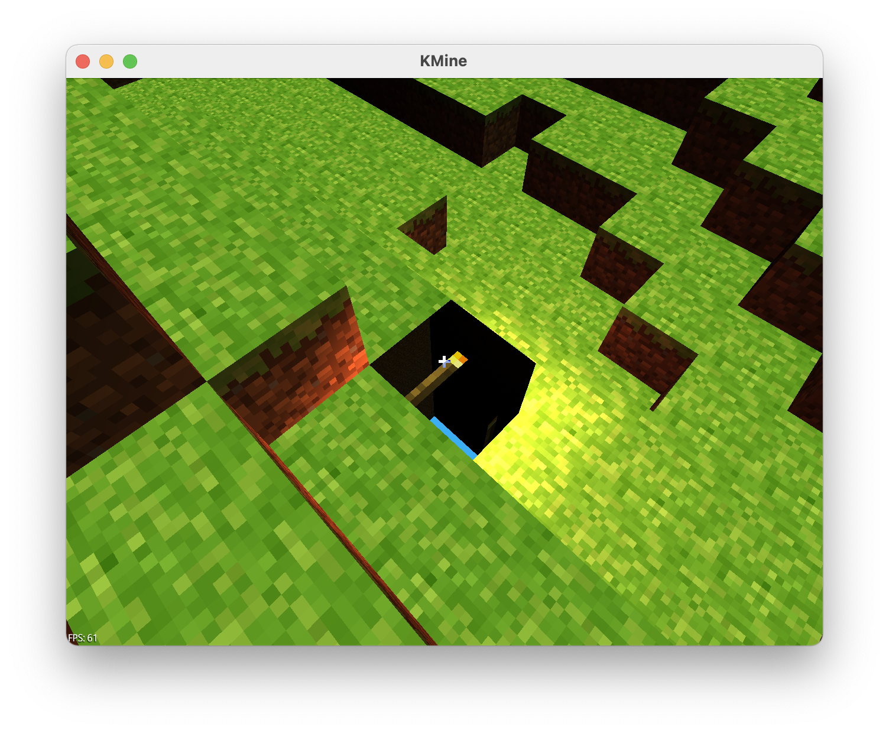
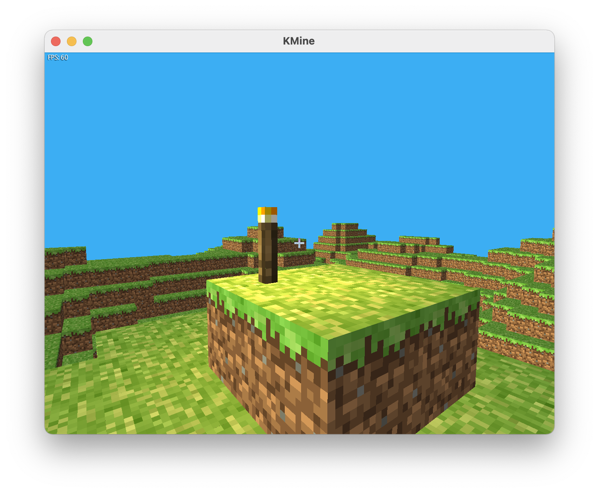
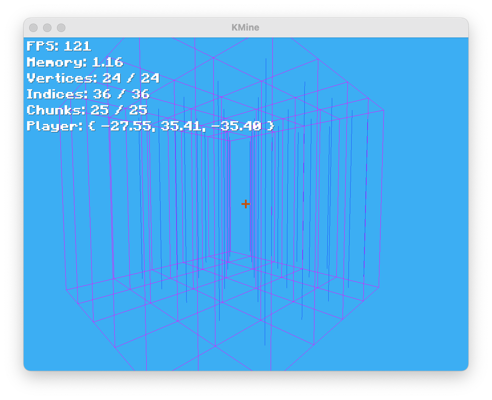
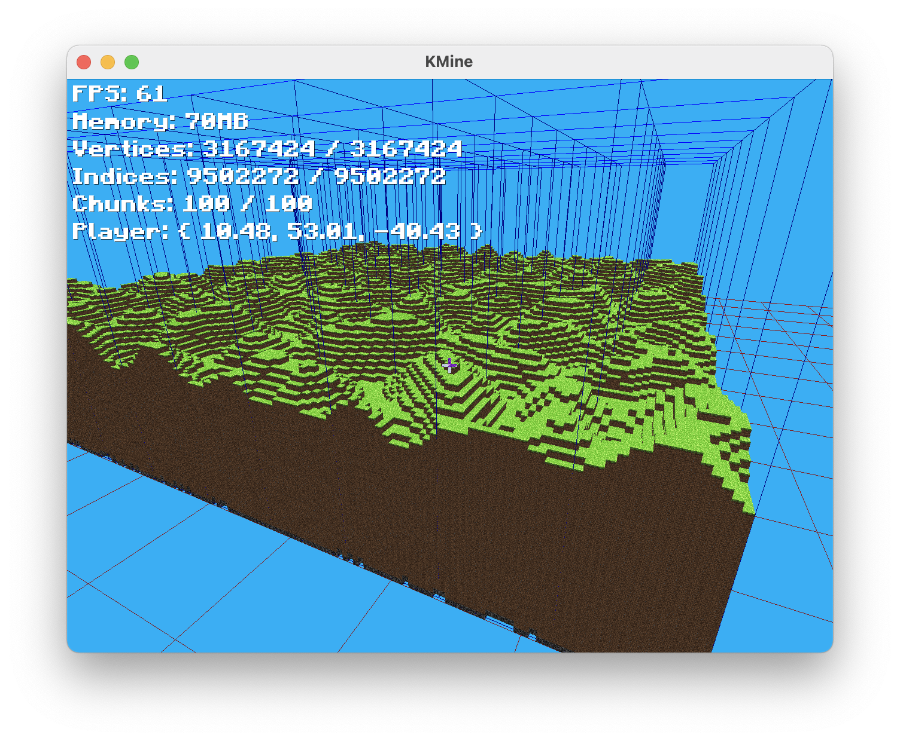
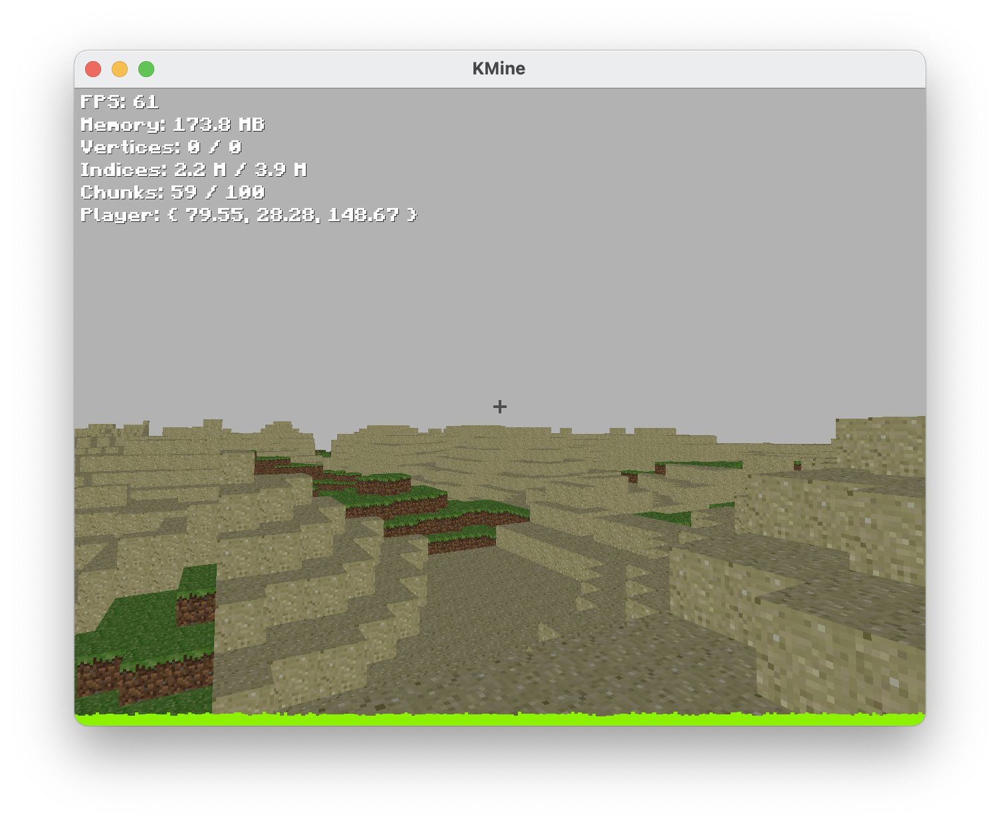

# KMine

A Minecraft clone made in Kotlin

TODO: Re-create the chunk system using layers instead of a 3d-array, therefore not saving useless empty blocks
TODO: Add multi-thread
TODO: Fix the biome interpolation
TODO: Fix the jumping system
TODO: Re-add the flying camera
TODO: Add infinite terrain system

## Development process

### Day 1

This project is my first contact ever with LibGDX and LWJGL, I always made use of a Game engine or framework like SFML or Allegro.
Started by trying to display a simple cube, was straight forward using the already defined Box model in LibGDX; But for performance reasons, this wouldn't be enough for the project.
Knowing that, started experimenting with creating a cube by its vertices and mapping them to a single material and texture, differentiating only on the texture coordinates for each face

The texture Atlas was made using [GDX Texture Packer](https://github.com/crashinvaders/gdx-texture-packer-gui)
The textures used were fetched from the classic minecraft

---

### Day 2

Created a simple Camera controller;
Added a turquoise background color to recall the sky;
Using the incredible project [OpenSimplexNoise](https://gist.github.com/KdotJPG/b1270127455a94ac5d19) (A following work post-perlin noise) to generate a simple terrain
with a simple chunk system, the chunks for now doesn't know its neighbors, therefore rendering unnecessary chunk borders (Todo this)

For the rest of the second day I fought with Gradle and IntelliJ, out of the blue the project stopped building
The wonderful Kotlin-ready-template made by [maltaisn](https://github.com/maltaisn/kmine) helped to solve the issues
- Pros -> I updated the libraries
- Cons -> Lost a significant amount of hours in this

After all the fighting I changed the noise function to use the third dimension

---

### Day 3

First of all, had my introduction to OpenGL ES shaders.
I was hoping to create a fragment shader that would invert the screen texture for the crosshair texture. Just like the original game
But I ended up using OpenGL blending to achieve the effect

Started experimenting with lighting as well, trying to make a day-night cycle
And added the "torch cube" lol

After a little bit of tweaking..

Also added a different font .ttf to the HUD
Added support for varying display density
And smoother camera movement

### Day 4
To start, I just wanna share a video on how to project is going so far.

Basically I worked in rewriting the chunk system, but to made usage of the Renderable class
This would allow me to apply shaders at the chunk mesh
A sneak peek of how it went

*Basically, I've created some bugs*

### Day 5
After hours of work, managed to find the problem... Turns out that the mesh.numVertices was returning a smaller value
therefore the mesh would simply render a part of the mesh

Also added a Gizmo system to facilitate debugging
Managed to consider the neighbor chunks while generating the mesh, therefore ignoring faces being occluded by them

### Day 6
Resumed the work on the Physics engine, after successfully creating a tile based Y ground collision; I decided to move to [Bullet physics](https://pybullet.org/wordpress/index.php/forum-2/)
After many and many bugs, managed to make it work with the player.
After that I've made a simple raycast system and created the system to allow player to break and place cubes
